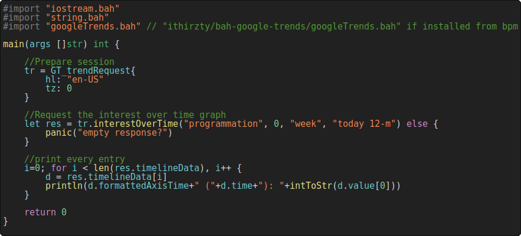

# Bah Google Trends API
This library allows you to use the Google Trends API in Bah.

```sh
bpm -install ithirzty/bah-google-trends
```

## Support
Still a work in progress...
- [x] Interest over time
- [ ] Interest by region
- [ ] Related topics
- [ ] Related queries
- [ ] Comparing

# Usage
See [test.bah](test.bah) for more information.
